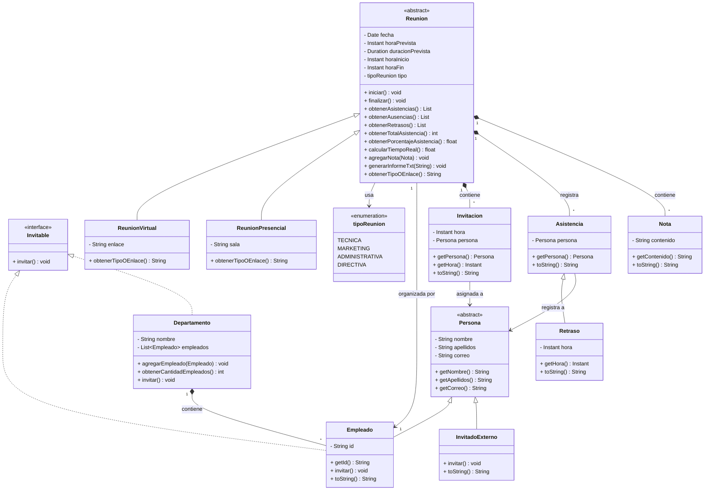
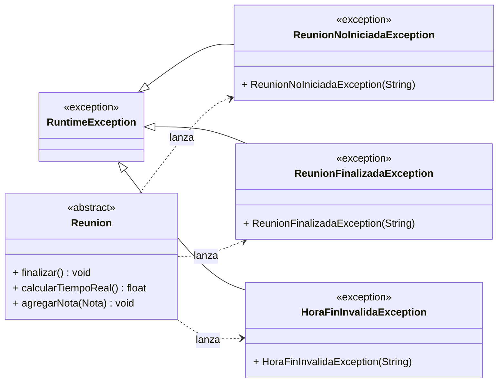

# Tarea2 
Integrantes:
Javiera Antonia Diaz Grandon 
Tomas Ignacio Pizarro Abarca
Pablo Sebastian Bascuñan Espina

Este proyecto consiste en la simulacion de un sistema corporativo para la gestion de reuniones empresariales desarrollado en java, 
el sistema permite planificar reuniones presenciales y virtuales, controlar las listas de invitados, registrar la asistencia en tiempo real 
(identificando asistentes a tiempo y retrasos), calcular estadisticas de participacion y la exportacion de un informe detallado en formato .txt.

El codigo se organiza bajo el paquete "Tarea2" e incluye las siguientes funcionalidades:
sistema de participantes: implementacion de clases abstractas para "Persona" con sus respectivos miembros especificos "Empleado" e "InvitadoExterno".
gestion de reuniones: uso de una jerarquia de reuniones con clases especializadas para "ReunionVirtual" y "ReunionPresencial".
logica de negocio: existen clases como "Invitacion", "Asistencia" y "Retraso" que controlan el flujo de los participantes y el calculo de ausencias.
categorizacion y reportabilidad: uso de un enum "tipoReunion" para clasificar las reuniones y ejecucion de informes automaticos.

### Para ejecutar el proyecto:
1. Clonar el repositorio.
2. Abrir el proyecto en un IDE (intelliJ IDEA recomendado).
3. Configurar el SDK (java 17 o superior).
4. Ejecutar la clase "Main" ubicada en "src/main/java/Tarea2/Main.java".

### Justificacion del diseño y modificaciones son :
1. **Clase abstracta Persona:** El modelo original solo mostraba la clase Empleado. Se identifico que Empleado e InvitadoExterno comparten los mismos tributos base (nombre, apellido, correo), por lo que se creo la clase abstracta Persona como superclase común. Esto evita la duplicacion de codigo y permite un manejo polimorfico de los participantes en las listas de Invitacion y Asistencia, que ahora trabajan con Persona en lugar de solo Empleado.
2. **Clase InvitadoExterno:** La tarea exige perimitir que personas externas a la empresa puedan participar de las reuniones. Por lo que, se creo InvitadoExterno como subclase de Persona que implementa Invitable. Al usar Persona como tipo en Invitacion y Asistencia, el sistema acepta tanto empleados como invitados extternos sin modificar la logica central de Reunion.
3. **Enum tipoReunion con categorias extendidas:** El modelo original proponia TECNICA, MARKETING y OTRO. Se reemplazo OTRO por ADMINISTRATIVA y DIRECTIVA para restringir las categorias de las reuniones a opciones validas y estandarizadas dentro del contexto corporativo real, evitando una categoria generica que no aporta un dato significativo.
4. **Clase Invitacion y Metodo obtenerAusencias():** Se creo el objeto Invitacion como puente formal entre Reunion y Persona. Esto permite implementar obtenerAusencia() comparando la lista de invitaciones contra los registros reales de asistencia, identificando con precision quien falto al evento.
5. **Metodo generarInformeTxt():** Se añadio el metodo abstarcto obtenerTipo0Enlace() a Reunion, implementando por ReunionVirtual (devuelve el enlace) y ReunionPresencial (devuelve sala), El metodo en concreto generarInformeTxt() genera un informe completo en .txt con fecha, horas, tipo, participantes, retrasos, ausencias y notas.
6. **Excepciones personalizadas:** Se crearon tres excepciones propias (ReunionNoIniciadaException, ReunionFinalizadaException y HoraFinInvalidaException) para proteger el ciclo de vida de la reunion. Estas restringen operaciones invalidas como finalizar sin haber iniciado una reunion, agregar notas a una reunion cerrada, o registrar una hora de fin anterior al inicio. 

El **diagrama UML** se completo mediante las herramientas de git:

### Diagrama principal

### Diagrama de excepciones

